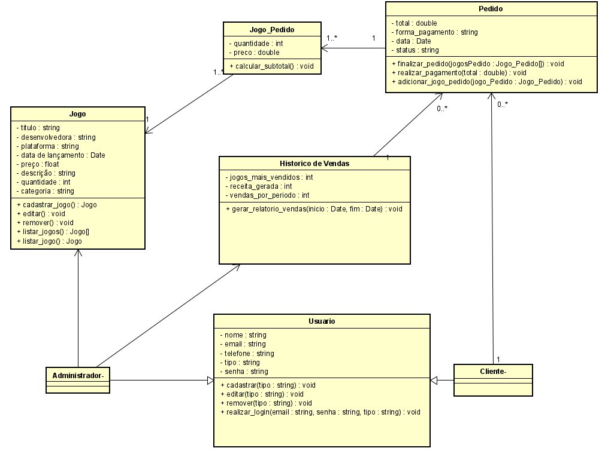

# Projeto Orientado a Objetos: Loja virtual de jogos com MVC, DESIGN PATTERNS e SOLID

## Introdução:

Esse projeto faz parte da disciplina de Projeto Orientado a Objetos do curso de Engenharia de Computação, 10° período. Foi proposto para os alunos criarem um projeto
em que seria MODELADO e IMPLEMENTADO do zero algum sistema de escolha do aluno, seguindo ARQUITETURA, DESIGN, PRINCÍPIOS e BOAS PRÁTICAS de código. Eu escolhi uma
 loja virtual de jogos, e aqui está o projeto.

## Diagrama de Classes:

